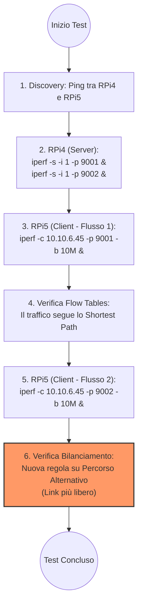

# SDN_Gruppo4_2026
## Progetto 4. Load Balancing (least load)
Scrivere un programma Ryu che:
- Monitori il carico su ogni link.
- Per ogni nuova connessione scelga il percorso a costo minimo dando un peso minore ai collegamenti scarichi.
- Carichi sullo switch una regola per l'instradamento senza più passare dal controllore.

---

## 🧪 Workflow Sperimentale (Laboratorio)
In laboratorio abbiamo utilizzato una topologia reale composta da Switch Open vSwitch e Raspberry Pi (RPi4 e RPi5). Il seguente diagramma illustra i passaggi eseguiti per validare il bilanciamento del carico:



### Comandi eseguiti sugli Host:
- **RPi4 (Server):**
  ```bash
  iperf -s -i 1 -p 9001 &
  iperf -s -i 1 -p 9002 &
  ```
- **RPi5 (Client):**
  ```bash
  # Primo flusso (percorso breve)
  iperf -c 10.10.6.45 -p 9001 -b 10M &
  
  # Secondo flusso (percorso alternativo per carico)
  iperf -c 10.10.6.45 -p 9002 -b 10M &
  ```

---

## 💻 Ambiente Simulato (Mininet)
Se si desidera testare il progetto in un ambiente simulato, utilizzare i seguenti comandi.

### Setup della rete
Comando standard:
```bash
sudo mn --mac torus,3,3 --controller-remote
```
Rete custom (simile al laboratorio):
```bash
sudo mn --mac --custom topo_load_balancer.py --topo LBTopo --controller remote
```
Rete custom con link a capacità predefinita [100Mb/s]:
```bash
sudo mn --mac --custom topo_load_balancer.py --topo LBTopo --controller remote --link tc,bw=100
```
Rete custom che simula le condizioni del laboratorio:
```bash
sudo mn --mac --custom topo_simulated_lab.py --topo LBTopo --controller remote
```

---

## 🛠️ Esecuzione del Controller
Per avviare il load balancer insieme al gestore dei flussi:
```bash
ryu-manager --observe-link load_balancer.py flowmanager/flowmanager.py
```

### Monitoring GUI
L'interfaccia grafica per monitorare i flussi in tempo reale è disponibile a:
[http://localhost:8080/home/index.html](http://localhost:8080/home/index.html)

---

## 👥 Authors
- Matteo
- Pietro
- Walter
- Taddeo
